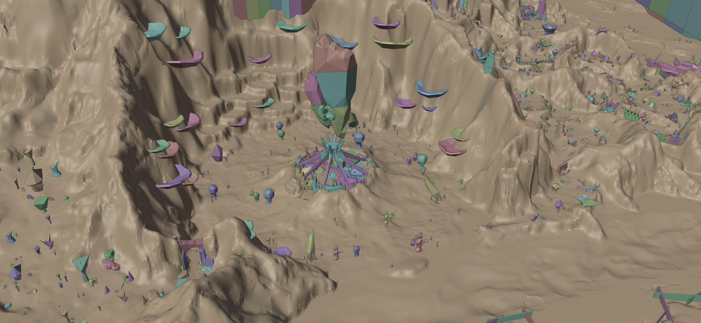
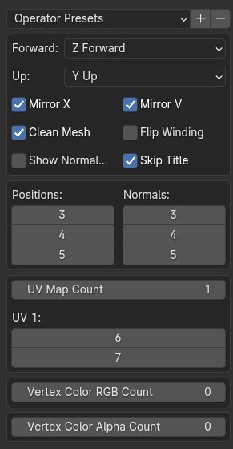

This is a couple of scripts along with a guide on how to import Aion .geo files into the blender, create navmeshes and export them in .nav format compatible with [ARP](https://github.com/Yoress/ARP/tree/master) and [Aion 5.8 Community Project](https://github.com/MATTYOneInc/AionEncomBase).

Few things to note:

1. I'm not a programmer - don't expect these scripts to be perfect in any way.

2. The guide is pretty thorough and I've tried to mention every key combination and action I do. The actual process is pretty fast once you learn it.

3. Blender 4.0.2 is used. Compatibility with other versions is not guaranteed.

4. Only monono2 geodata is supported.

5. Before making navmeshes, check out [5.8 navmesh pack](https://drive.google.com/file/d/1ulkx0TwdDZnFZL5ildkVFtD1WQ3jGA7p/view?usp=sharing) and [other versions](https://drive.google.com/file/d/1sL8kpHc3-oO75roO4dmTgLCJi_7obmuL/view?usp=sharing) to see if navmeshes for these maps were already built. Nav files themselves are not version dependent - 5.8 navmeshes will work on lower versions as long as the maps themselves didn't change between versions.

### I. Importing .geo into blender:
1. Start blender, remove everything from the scene ("A" + "X"), go to the "Scripting" tab.

2. Drag the "blender import aion .geo monono2.py" script into the right large window. You should see the code now. There you need to change two lines:

mapname = "210040000.geo" - name of the file you want to import.

path = "aion" - path to the folder with your .geo files and meshs.geo.

Once those are set, press "Alt+p" to run the script. Importing should take 5 - 90 seconds depending on the map complexity and your cpu.

Many aion maps are large and don't display well inside blender with default settings. To fix that, move your cursor into the 3D viewport, press "N", go to "View" tab and change "Clip Start" and "End" to 1m and 7000m respectively.

### II. Building the navmesh:
Sadly, we can't build navmeshes for large maps within blender itself. For that we will need some external tools and extra steps.

#### For small maps:

1. Install [RecastBlenderAddon](https://github.com/przemir/RecastBlenderAddon). Github page for it has installation instructions.

2. Select all objects you want to have navmesh built for (or the entire scene by pressing "A")

Go to Scene properties -> recast navmesh.

3. Play with the settings and press "Build Navigation Mesh".

This will create and select a navmesh. If it didn't, then your map is probably too large and you will have to follow the alternate approach. You can also try to build several smaller navmeshes by selecting only parts of the level. Those navmeshes can then be combined with "Ctrl + J".

4. With navmesh selected, press "Tab" to switch to edit mode. There, select everything with "A", then press "M -> By distance". Repeat this action until you see "Removed 0 vertice(s)".

(optional) To make the navmesh more optimized, you can apply a "Decimate" modifier with whatever ratio you want. For me ratio of 0.5 works pretty well. After that, you have to repeat the previous step of pressing "M -> By distance" until you see 0 removed.

(optional) You can also remove inaccessible parts of the navmesh by switching to edit mode and selecting whatever polygons you want to remove, shortcut "L" works well here, selecting all connected polygons at your mouse cursor. Selected polygons can be deleted by pressing "X".

Done! You can now go to the “Exporting the navmesh” step.

#### For large maps:

This is a DUMB approach. If you have a better way - feel free to share.

You will need:

A lot of RAM or swap space for certain large maps - over 24GB.

recast4j to build tiled navmeshes. You can either build the recast-demo from [source](https://github.com/ppiastucki/recast4j), or download a [prebuilt one](https://drive.google.com/file/d/1o_KTF33Z78pd4z-bmNW4TiDSvxdZhcpg/view?usp=sharing).

[NVIDIA Nsight Graphics](https://developer.nvidia.com/nsight-graphics) to rip the navmesh from recast4j.

[Blender addon](https://github.com/Glurak006/CSV-Import/tree/master) to read ripped .csv meshes. You need to use this particular fork of the addon.

1. While inside blender, export our scene as .obj (File -> Export -> Wavefront(.obj) -> Export Wavefront OBJ).

2. Open NVIDIA Nsight, press "Connect", add Start.bat from recast-demo as application executable, then press "Launch frame debugger".

3. Load the exported .obj. On the right panel, enable the tiled option, set the tile size to 3600 - 4000 range. The higher the value, the less tiles we would need to export, but increasing the tile size may cause recast-demo to throw an exception. Most large maps can be generated with 3x3 tiles, some colossal maps may require 4x4 or even 5x5. Now generate the navmesh with the "build" button. Process will take several minutes. If after generation there is a navmesh over the entire map and the console has no exceptions, Then we are safe to go to the ripping part.

4. In recast-demo change Draw->Navmesh Trans, then press F11 to capture the scene. In the captured scene, select every individual navmesh tile and export it as .csv. This [youtube guide](https://www.youtube.com/watch?v=8jehCPUu0Jk) explains the process of using Nsight quite well.

5. If in the geometry window there is a "Floating Point Specials Detected in Vertex Data" warning, leave the capture by pressing F11, then switch Draw -> Navmesh BVTree, then try to rip the tile again.

6. Once all tiles are ripped, go to blender File->Import->Mesh CSV(.csv).

These are the settings used for importing:

7. After exporting all tiles, join them with "Ctrl + J", scale them with "S + Y + -1", then apply all transformations with "Ctrl + A".

8. With navmesh selected, press "Tab" to switch to edit mode. There, select everything with "A", then press "M -> By distance". Repeat this action until you see "Removed 0 vertice(s)". You can also use "Shift + R'' to repeat the last action to make this process a bit faster.

(optional) To make the navmesh more optimized, you can apply a "Decimate" modifier with whatever ratio you want. For me ratio of 0.5 works pretty well. After that, you have to repeat the previous step of pressing "M -> By distance" until you see 0 removed.

(optional) You can also remove inaccessible parts of the navmesh by switching to edit mode and selecting whatever polygons you want to remove, shortcut "L" works well here, selecting all connected polygons at your mouse cursor. Selected polygons can be deleted by pressing "X"

### III. Exporting the navmesh:
Drag the "blender export .nav.py" script into the same window we used for importing geo, change

mapname='210040000.nav'

to your map name.

Select your navmesh, switch to edit mode with "Tab".

Run the script "Alt+p". Now your file should be saved inside the blender folder.

